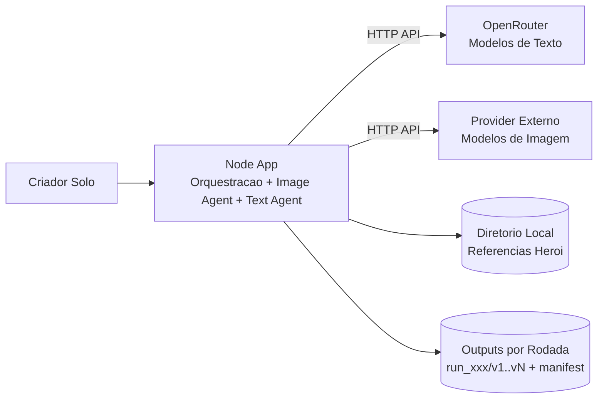

# PRD 001: Sistema Semi-Automatico de Geracao de Conteudo Estoico (Imagem + Texto)

## 1. Contexto

- **Sistema/produto**: Projeto com `node-app` (Node.js + LangChain) como orquestrador principal de texto e imagem, integrado diretamente a provedores externos de IA para geracao de imagem e ao OpenRouter para texto.
- **Estado atual**: Existe implementacao funcional do `node-app` com geracao de imagem remota por perfis (`quality`, `balanced`, `fast`, `low-cost`), geracao textual via OpenRouter, persistencia por rodada e curadoria manual. A operacao esta em validacao pratica e ajuste fino.
- **Problema**: Hoje a criacao manual de 1 conteudo (imagem + texto) leva cerca de 60 minutos. Isso reduz frequencia de producao e aumenta custo operacional. O objetivo principal e reduzir drasticamente esse tempo mantendo consistencia visual do heroi e estilo textual do canal.

## 2. Solucao Proposta

### Visao geral

- Implementar geracao de imagem via `Image Agent` dentro do `node-app`, chamando provedores externos de IA (sem servico proprio de geracao de imagem).
- Configurar o `Image Agent` com catalogo versionado de perfis (`quality`, `balanced`, `fast`, `low-cost`) e selecao por `image.model_profile` na rodada.
- Implementar um `Text Agent` via OpenRouter que gere `N` frases curtas e `N` reflexoes medias complementares por rodada, com `N` configuravel por ambiente (`GENERATION_VARIANTS`, padrao `1`).
- Executar pipeline semi-automatico por script/API, produzindo resultados pareados por versao e organizados em subdiretorios por rodada de geracao.
- Manter curadoria humana obrigatoria antes de qualquer uso externo (publicacao nao faz parte do escopo).
- Incluir telemetria minima de rastreabilidade por item (perfil solicitado, perfil resolvido, provider/modelo efetivo, prompt, seed quando disponivel, tempo e status).

### Decisoes-chave

1. Executar imagem por integracao direta do `node-app` com provedores externos. Motivo: remover dependencia de hardware local para inferencia pesada.
2. Controlar geracao por perfis versionados (`quality`, `balanced`, `fast`, `low-cost`) com override opcional por `image.model_profile`. Motivo: facilitar testes de modelo sem expor provider/modelo no contrato publico.
3. Tornar quantidade de variacoes por rodada configuravel por ambiente (`GENERATION_VARIANTS`) com padrao `1` para reduzir custo de validacao.
4. Restringir catalogo a modelos que suportem referencia do heroi e manter falha deterministica (sem fallback automatico). Motivo: preservar consistencia visual e previsibilidade operacional.
5. Manter operacao semi-automatica com curadoria manual. Motivo: garantir qualidade editorial e visual no estagio inicial sem complexidade de automacao de ranking/postagem.

### Fora do escopo

- Interface grafica web/app nesta fase, para priorizar entrega do motor de geracao.
- Publicacao automatica em redes sociais, para evitar aumento de escopo e riscos operacionais.
- Treinamento de LoRA customizado nesta fase inicial (fica em roadmap posterior).

## 3. Funcionalidades

### US01: Provisionar ambiente e servicos do projeto

Como criador solo, quero subir os servicos localmente com um comando padronizado, para iniciar o fluxo de geracao sem setup manual repetitivo.

**Rules:**
- O projeto deve iniciar com Docker Compose contendo o `node-app` e suas dependencias de suporte, sem depender de servico proprio de geracao de imagem.
- Pre-requisitos obrigatorios documentados e validados: Node.js 20+, Docker + Docker Compose instalados e variaveis de integracao com provedores externos configuradas.
- O startup deve validar carregamento do catalogo versionado de perfis de imagem e perfil global padrao.
- O projeto deve manter arquivo de exemplo de ambiente com variaveis de texto (OpenRouter) e imagem remota (backend, perfil padrao e credenciais).

**Edge cases:**
- Docker indisponivel na maquina local -> execucao deve falhar com mensagem explicita de pre-requisito e instrucoes de correcao.
- Perfil global de imagem ausente ou invalido -> pipeline nao deve iniciar e deve retornar erro orientativo de configuracao.

### US02: Gerar imagens consistentes do heroi

Como criador solo, quero gerar variacoes de imagem 9:16 em estilo dark fantasy com o mesmo heroi, para selecionar rapidamente artes coerentes para reels com controle de custo por rodada.

**Rules:**
- Entrada minima: `scene`, `mood`, `variation_level`.
- Cada execucao deve gerar `N` imagens por rodada, com `N` definido por `GENERATION_VARIANTS` (padrao `1`).
- O agente deve utilizar imagens de referencia armazenadas em diretorio local e envia-las ao provedor externo para reforcar similaridade com o heroi.
- O agente deve suportar backend de imagem configuravel por ambiente (`mock` e `remote`) e selecao de perfil via `image.model_profile`, sem alterar o contrato da rodada.
- O catalogo de perfis deve conter apenas modelos com suporte a uso de referencia de imagem do heroi.
- Output por imagem deve incluir `image_path` (ou base64), `prompt_used`, `seed`, `generation_time_ms`.

**Edge cases:**
- Diretorio de referencias vazio ou inacessivel -> geracao deve abortar com erro claro e sem retornar imagens inconsistentes.
- Falha parcial (menos imagens que o esperado) -> marcar rodada como incompleta, persistir o que foi gerado e retornar status parcial com motivo.
- `variation_level` fora do intervalo permitido -> normalizar para limite valido ou rejeitar com validacao explicita (inferido - validar).
- `image.model_profile` invalido ou ausente sem default global -> rodada deve falhar antes da primeira chamada externa.
- Provedor remoto indisponivel ou timeout do perfil excedido -> rodada deve falhar imediatamente, sem fallback automatico entre perfis.

### US03: Gerar textos estoicos em dois formatos

Como criador solo, quero gerar `N` frases curtas e `N` reflexoes medias complementares, para compor variacoes de copy de alto impacto no meu canal sem exceder custo por rodada.

**Rules:**
- Entrada minima: `theme`, `tone` (agressivo/reflexivo) e parametros de quantidade.
- Saida obrigatoria por rodada: `N` textos curtos + `N` textos medios, onde `N = GENERATION_VARIANTS`.
- O agente deve operar em modo flexivel de autoria: pode gerar textos originais, parafrasear ideias classicas ou citar autores estoicos conhecidos quando isso fortalecer a mensagem.
- Quando houver citacao direta de autor conhecido, o texto deve incluir atribuicao explicita do autor.
- Cada texto medio deve complementar semanticamente um texto curto correspondente (pareamento por versao).

**Edge cases:**
- OpenRouter indisponivel/timeout -> retornar erro recuperavel com tentativa de retry configuravel (inferido - validar).
- Solicitacao explicita para evitar citacoes -> o agente deve priorizar modo autoral e bloquear citacoes diretas na rodada.
- Resposta incompleta (menos itens que o esperado) -> completar apenas itens faltantes antes de finalizar rodada.

### US04: Persistir resultados pareados por rodada

Como criador solo, quero receber os resultados organizados em subdiretorios por execucao e por versao, para facilitar curadoria e reutilizacao.

**Rules:**
- Cada rodada deve criar um subdiretorio unico, por exemplo: `outputs/run_YYYYMMDD_HHMMSS/`.
- Dentro da rodada, salvar versoes pareadas (`v1..vN`), contendo imagem, texto curto e texto medio correspondentes.
- Deve existir um arquivo de metadados consolidado da rodada (`manifest.json`) com parametros de entrada, modelos, seeds, tempos e status.
- Quando a imagem vier em base64, o sistema deve materializar arquivo local na pasta da versao e persistir `image_path` local.

**Edge cases:**
- Colisao de nome de diretorio de rodada -> gerar sufixo unico automaticamente sem sobrescrever resultados anteriores.
- Erro de escrita em disco -> interromper rodada com status de falha e log detalhado para diagnostico.

### US05: Executar curadoria manual com rastreabilidade

Como criador solo, quero revisar os resultados antes de uso externo, para manter aderencia ao escopo editorial do canal.

**Rules:**
- O sistema deve expor status por item (`approved`, `rejected`, `pending`) para controle manual de curadoria (inferido - validar).
- Itens rejeitados devem manter historico de motivo para aprendizagem de prompt futura.

**Edge cases:**
- Nenhum item aprovado na rodada -> rodada deve poder ser regenerada com os mesmos parametros base.
- Curadoria interrompida no meio -> estado parcial deve ser persistido para retomada.

## 4. Visao de Arquitetura



Exemplo de arquitetura interna do Image Agent no `node-app`:

```text
Input da rodada
    -> Validador
    -> Resolutor de perfil (image.model_profile ou default global)
    -> Policy engine (perfil valido, suporte a referencia, timeout, elegibilidade pago)
    -> Reference loader (diretorio do heroi)
    -> Provider adapter (chamada multimodal externa)
    -> Normalizador de resposta
    -> Persistencia (v1..vN + manifest)
```

Componentes principais desta feature: `node-app` com agentes de texto e imagem, integracoes externas de IA, estrutura de `outputs` versionada por rodada e contrato de pareamento imagem/texto.

## 5. Criterios de Aceite

### Tecnicos

| Criterio | Metodo de verificacao |
|----------|----------------------|
| Ambiente atende pre-requisitos minimos: Node.js 20+, Docker e Docker Compose, e credenciais remotas configuradas | Checklist automatizado em script de bootstrap + validacao de variaveis no startup |
| Dependencias base instalaveis conforme documentacao: LangChain JS (`langchain`, `@langchain/core`) e SDK HTTP do provedor de imagem escolhido | Execucao limpa de instalacao em maquina nova + lockfile versionado |
| Configuracao de ambiente inclui variaveis de imagem e texto (backend `remote`, perfil global padrao e credenciais) | Revisao de `.env.example` + teste de startup em modo `mock` e modo `remote` |
| `docker compose up` sobe `node-app` com healthcheck funcional e validacao de catalogo de perfis | Teste em ambiente local: `node-app` em estado healthy e pipeline apto para chamada externa |
| Uma rodada gera `N` imagens 9:16 + `N` textos curtos + `N` textos medios pareados em `N` versoes (`N = GENERATION_VARIANTS`, padrao 1) | Teste de integracao ponta a ponta validando quantidade, dimensao e estrutura de saida |
| Cada rodada cria subdiretorio unico com `manifest.json` completo e metadados de perfil (`requested_profile`, `resolved_profile`, provider/modelo) | Teste automatizado de arquivos e schema do manifesto |

### De negocio

| Metrica | Baseline (fonte) | Meta | Prazo | Min. aceitavel | Responsavel |
|---------|-------------------|------|-------|-----------------|-------------|
| Tempo medio para produzir 1 pacote curado (1 imagem + 1 curto + 1 medio) | 60 min (medicao manual do criador, inferido - validar em planilha de controle) | 5 min por pacote | A definir (inferido - validar: 30 dias apos MVP) | 10 min por pacote | Criador solo (voce) |

**Regras:**
- Baseline deve ser registrado em historico de pelo menos 10 execucoes manuais para consolidacao.
- Se a meta de 5 min nao for atingida no prazo, a entrega so sera aceita se ficar <= 10 min por pacote e com qualidade editorial aprovada.

## 6. Milestones

### Milestone 1: Estruturar Fundacao Tecnica

**Objetivo:** Entregar ambiente local reproduzivel com servicos iniciando de forma confiavel.

**Funcionalidades:** US01

- [ ] Criar estrutura inicial de pastas (`node-app`, `assets`, `prompts`, `outputs`) referenciando US01
- [ ] Configurar Dockerfiles e Compose com healthchecks referenciando US01
- [ ] Implementar endpoint de health do `node-app`, script de pre-check de ambiente e validacao do catalogo de perfis referenciando US01

**Criterio de conclusao:**
- Condicao: qualquer maquina alvo sobe os servicos sem ajuste manual nao documentado.
- Verificacao: execucao de bootstrap + `docker compose up` + checklist tecnico.
- Aprovador: Voce (owner do projeto).

### Milestone 2: Entregar Geracao de Imagem Consistente

**Objetivo:** Gerar imagens 9:16 com consistencia visual do heroi usando referencias locais e custo controlado por rodada.

**Funcionalidades:** US02

- [x] Implementar contrato de entrada/saida do Image Agent no `node-app` referenciando US02
- [x] Integrar leitura de imagens de referencia do heroi e envio ao provedor externo referenciando US02
- [x] Persistir metadados de prompt/seed/tempo por imagem, incluindo perfil e modelo efetivo, referenciando US02
- [x] Implementar catalogo versionado de perfis e configuracao por ambiente do backend de imagem (`mock` e `remote`) referenciando US02

**Criterio de conclusao:**
- Condicao: rodada de imagem retorna `N` itens validos com metadados completos (`N = GENERATION_VARIANTS`).
- Verificacao: teste de integracao com casos feliz e falha parcial.
- Aprovador: Voce (owner do projeto).

### Milestone 3: Entregar Geracao Textual Pareada

**Objetivo:** Gerar `N` curtas e `N` medias com complementaridade por versao.

**Funcionalidades:** US03

- [x] Implementar prompt base e validacoes de originalidade textual referenciando US03
- [x] Integrar OpenRouter e estrategia de retry em falhas temporarias referenciando US03
- [x] Garantir pareamento semantico curto/medio por versao referenciando US03

**Criterio de conclusao:**
- Condicao: rodada textual retorna `2N` itens validos (`N` curtos + `N` medios), pareados por versao.
- Verificacao: testes de contrato e revisao manual de 5 rodadas.
- Aprovador: Voce (owner do projeto).

### Milestone 4: Consolidar Pipeline e Curadoria

**Objetivo:** Unificar imagem + texto com saida organizada por rodada e fluxo de curadoria manual.

**Funcionalidades:** US04, US05

- [x] Implementar estrutura de subdiretorios por rodada com `manifest.json` referenciando US04
- [x] Persistir versoes pareadas (`v1..vN`) com ativos e metadados referenciando US04
- [x] Implementar estados de curadoria e historico de motivo de rejeicao referenciando US05

**Criterio de conclusao:**
- Condicao: pipeline ponta a ponta gera resultados organizados, rastreaveis e prontos para curadoria.
- Verificacao: demo completa de uma rodada + checklist de aceite tecnico e de negocio.
- Aprovador: Voce (owner do projeto).

## 7. Riscos e Dependencias

| Risco | Impacto | Mitigacao | Status |
|-------|---------|-----------|--------|
| Provedor externo de imagem indisponivel | Alto | Falhar rapido com erro explicito, registrar `failure_reason` no manifesto e repetir rodada manualmente | Pendente |
| Inconsistencia visual do heroi sem LoRA treinada | Medio | Usar referencias obrigatorias e calibracao iterativa de prompt/seed | Monitorando |
| Latencia/custos variaveis no provedor de texto | Medio | Definir modelo padrao, limites de retry e timeout por rodada | Pendente |
| Latencia/custos variaveis no provedor de imagem remoto | Medio | Timeout por perfil com teto global de 90s e governanca por catalogo versionado | Pendente |
| Perda de produtividade por excesso de regeneracao manual | Medio | Registrar motivos de rejeicao e ajustar prompts por ciclos curtos | Pendente |

**Dependencias:**

| Dependencia | Tipo | Status | Impacto se bloqueado |
|-------------|------|--------|----------------------|
| Docker e Docker Compose instalados no host | Interna | Pendente | Bloqueia Milestone 1 e todas as demais |
| Chave/API de acesso OpenRouter | Externa | Pendente | Bloqueia Milestone 3 e 4 |
| Chave/API de acesso ao provedor externo de imagem | Externa | Pendente | Bloqueia Milestone 2 e compromete Milestone 4 |
| Catalogo versionado de perfis de imagem e validacao de modelos com suporte a referencia | Interna | Pendente | Pode bloquear conclusao tecnica da US02 |
| Definicao final de limites de qualidade editorial | Interna | Pendente | Pode atrasar aceite de negocio no Milestone 4 |

## 8. Referencias

- [PRD inicial do projeto](prd-inicial.md) - base de escopo e direcao funcional inicial.
- [System Prompt para criacao de PRD](system-prompt-criar-prd.md) - formato, rigor e regras de elaboracao.
- [LangChain JS - Install](https://docs.langchain.com/oss/javascript/langchain/install) - pre-requisitos Node.js 20+ e instalacao dos pacotes base.
- [Docker Compose - Documentacao oficial](https://docs.docker.com/compose/) - orquestracao local, healthchecks e dependencia entre servicos.

## 9. Registro de Decisoes

- **2026-04-09:** Projeto sera iniciado do zero (bootstrap completo). Motivo: inexistencia de implementacao funcional consolidada.
- **2026-04-09:** Persona principal definida como criador solo com uso diario. Motivo: foco de produto e criterio de aceite alinhado ao uso real.
- **2026-04-09:** Prioridade principal definida como reducao de tempo de criacao manual. Motivo: principal dor operacional atual.
- **2026-04-09:** Rodada passou a ser configuravel por `GENERATION_VARIANTS`, com padrao 1 para validacao economica e controle de custo. Motivo: reduzir consumo de credito durante ajuste fino do pipeline.
- **2026-04-09:** Similaridade visual com heroi via diretorio de referencias obrigatorio na fase inicial (sem LoRA). Motivo: garantir consistencia imediata com menor complexidade tecnica.
- **2026-04-09:** Geracao de imagem local foi removida; a execucao real passa a ser feita por chamada direta do `node-app` para provedor externo de IA. Motivo: hardware local insuficiente para inferencia pesada.
- **2026-04-09:** Selecao de imagem padronizada por `image.model_profile` com catalogo versionado (`quality`, `balanced`, `fast`, `low-cost`) e fallback para perfil global quando ausente. Motivo: governanca e flexibilidade operacional.
